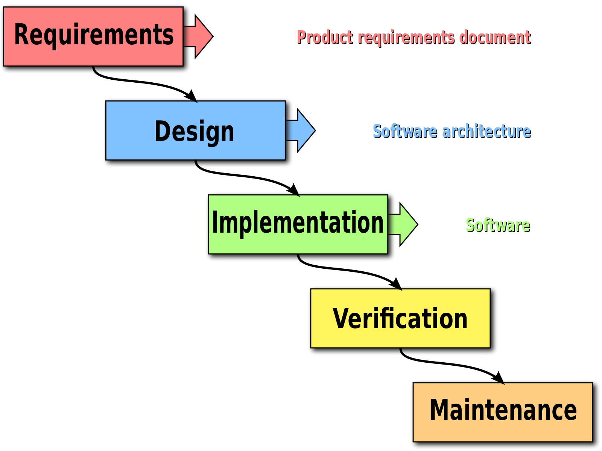

## Introduction

Almost every gadget around us uses software to operate, whether it be a hearing aid or an MRI machine. Software plays a
major role in making every gadget operational and useful for its respective task. A lot of resources go into making the
software work. But not enough attention is given to the software being safe, secure, behaving correctly, effects on
other parts of the system(s). Yet, still somehow software still works.

Some of the reasons for the software being insecure

-   Poor communications (between all parties involved)
-   Commercial pressures
-   Poor system design
-   Poorly defined system requirements
-   Inaccurate estimates of required resources
-   Unmanaged Risks
-   Sloppy Development Practices
-   Use of immature technologies
-   Stakeholder politics

and many more... [[1]](#references)

### Importance of Secure Software Systems

> What are the repurcussions of an insecure software or a software failure?

While it might not seem like a big deal, software failures can have serious consequences. Here are some events that
illustrate this:

-   Injury & Loss of Life [[2]](#references)
-   Loss of financial assets [[1]](#references)
-   Loss of resources: organizational assets [[3]](#references), the organization itself
    [[1]](#references).
-   Loss of the software system: Denial of service
-   Loss of valuable or sensitive information
-   Loss of trust\*

\*The trust factor is not measurable but has a direct impact on the application usage.

And if the bugs were not enough, there are active adversaries trying to exploit vulnerabilities in software systems.
These adversaries are:

-   Well-organized, similar to small businesses
-   Well-resourced, ranging from organized crime to nation states
-   Sophisticated in their technical abilities and attack methods

   _Source:_
[_The Different Types of Hackers and Their Motivations: An Overview_](https://www.linkedin.com/pulse/different-types-hackers-motivations-overview-yagnik-kathiriya "The Different Types of Hackers and Their Motivations: An Overview")

> How do we identify the risks?

To identify the risks, one must look at the attacks.

### Mitigations for Insecure Software

There are ways in which a couple of reasons for software being insecure mentioned above can be mitigated.

-   _Poor System Design_
    -   Giving a thought to security during the system design.
-   _Unmanaged Risks_
    -   Identifying security risks beforehand.
-   _Sloppy Development Practices_   Certain measures can be put in place to prevent such practices, including but
    not limited to: - Software Development Guidelines - Software Lifecycle Management - Code Review Process

> What about using crypto, or anti-virus, or any other kind of Security Features?

**"Security Features"** are not the answer. Just by using Anti-virus, Crypto, Implementing your own Cryptographic
Algorithm, using Open Source Software, or any other kind of Security Software is not going to provide you with a
solution.

Furthermore, security through obsecurity is also not the answer to the problem. Like adding barriers is not going to
stop a user from finding other ways to bypass the system, thus, making it more insecure (CWE-655). The situation can
develop a loss of trust within the user and the software system.

  _Source:
https://youtu.be/pqyFG-G4hF8?si=lt4FKxSA1dROA1J4_

There is a trade-off between Security and usability/convenience. Interestingly, new ways are being explored to find a
balance in usable security.

### Measuring Security

There are a lot of places where one can retrieve information around the vulnerabilities. These location contain an
extensive and actively updated information around the defects within the code.

1. CISA Cybersecurity Advisory, https://www.cisa.gov/news-events/cybersecurity-advisories
1. Debian Security Tracker, https://security-tracker.debian.org/tracker/
1. National Vulnerabilities Database/CVE, https://nvd.nist.gov/general/nvd-dashboard
1. MITRE CVE Database, https://cve.mitre.org/

### Common Weakness Enumeration (CWE)

The common weaknesses enumeration defines common weaknesses in software that have security implications. This is a
language that communicates the root cause of the vulnerability.

Difference from vulnerabilities:

-   Weaknesses can be thought of as mistakes or flaws (intentional or unintentional) in the software that can have
    serious system level impacts.
-   Vulnerabilities allow adversaries to take advantage of accessible weaknesses that are exploitable in order to
    achieve their attack goals.

For example, when a vulnerability says that it is a buffer-overflow, that sentence in itself is useful only to a certain
extent. Was it a out of bounds read/write? CWE can be attached to the vulnerability that will help in explaining why the
vulnerability occurred. Try looking up CWE-125 or CWE-787 for more details.

> What about Cross-Site Scripting (XSS)? Is it an attack or a weakness?

The `XSS` is an attack, at heart of which lies a weakness termed Improper Neutralization of Input During Web Page
Generation (CWE-79).

Similarly, `SQL Injection` is an attack which is caused by Improper Neutralization of Special Elements used in an SQL
Command (CWE-89).

While going through a CWE, you will see a section covering consequences. The heading in the page is
`Common Consequences` and they describe the impact on the application if the weakness is not fixed. However, not all the
technical impact will be accurate to the application being addressed. It is upto the security personnel to educate the
developer, what will happen if the weakness is not addressed.

### Weakness Inception within Software

The following diagram shows the different layers of software over the operating system.

The weakness can exist anywhere along these layers. The criticality of the weakness increases from top to bottom. If
there is a weakness within the Hardware, then it is extremely difficult to mitigate it as upgrading hardware is not
easy. In contrast, upgrading an application is much easier due to the availability of internet and in-place upgrade
mechanisms within the software. As a software developer, one has to think about all the aspects of each layer while
writing a software.

  _Source:
https://upload.wikimedia.org/wikipedia/commons/thumb/e/e2/Waterfall_model.svg/1600px-Waterfall_model.svg.png_

Each level of the software model incurs a security review. For example, in requirements phase, having a documentation is
a step. However, if the documentation for some reason is incomplete/inconsistent, then it is a security risk (CWE-1112,
CWE-1059, and more.). The security impact is indirect in this case as issues with documentations are primarily quality
focused. This doesn't mean that one should never write any documentation, rather address the important or critical
aspects of the application being developed.

A majority of the weaknesses are found in the implementation phase, but they can be traced back to the requirements
phase.

> Is it possible to write secure code at all?

The answer is **Yes**. Developers don't share how one can write secure code due to various reasons, some of them being,
insufficient understanding of the concepts, company restrictions, insufficient documentation (except in their minds),
etc. CWE can help with that. It is designed to assist the developer in writing secure code and sharing it with their
peers and public.

One thing to note is what the CWE doesn't do is observing the human processes like in an organization or processes like
for example, if the company doesn't have a security policy, there is no mapping within CWE to address it.

### Secure Development Models

An organization level of security risk can be addressed by following a secure development lifecycle. It encapsulates a
software model with security findings. Some examples of Secure Development Models are:

1. Building Security In Maturity Model (BSIMM) -
   https://www.synopsys.com/software-integrity/software-security-services/bsimm-maturity-model.html
1. Software Assurance Maturity Model (SAMM) - https://owaspsamm.org/
1. Microsoft Security Development Lifecycle (SDL) - https://www.microsoft.com/en-us/securityengineering/sdl

To pick one, Microsoft has a built the SDL for themselves and have provided information publicly to everyone on how to
proceed in different stages:

  _Source:
https://learn.microsoft.com/en-us/archive/technet-wiki/t/resources/5554.sdl_5f00_steps.jpg_

Detailed description of each step can be viewed here:
https://learn.microsoft.com/en-us/archive/technet-wiki/7100.the-security-development-lifecycle

## References

The references are provided as URLs, however, if the original content is for some reason not accessible then the
information is recorded as a copy of the original content under `docs/references`.

1. [Why software fails?](https://spectrum.ieee.org/why-software-fails) (2005) by Robert N. Charette
1. [Medical Devices: The Therac-25\*](https://www.cs.colostate.edu/~bieman/CS314/Notes/therac25.pdf) by Nancy
   Leveson
1. [Analyzing Software Failure on the NASA Mars Climate Orbiter](https://blog.cdemi.io/analyzing-software-failure-on-the-nasa-mars-climate-orbiter/)
   (2017) by Christopher Demicoli
