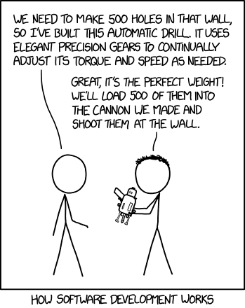
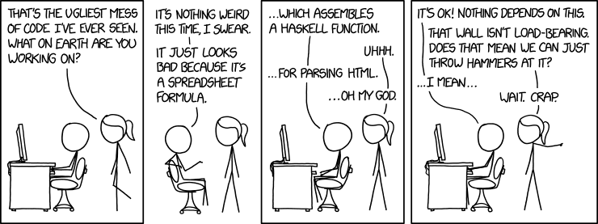

## Design Problems

**Wicked Problem**[[1](#references)]

A problem that can be clearly defined only by solving it or solving a part of it (Horst Rittel and Melvin Webber, 1973).
You essentially solve the problem first to define the problem, then solve it again to find a solution that works.

"Design" is a wicked problem.

   _Source: https://xkcd.com/2021/_

## Software Design

<b>Book Recommendation</b>

Software Engineering Design by Carlos Otero 2012 https://a.co/d/0cXzdeok

 

Some concepts of software designs can be described as

-   **_Abstraction_**: Deals with creation of conceptual entities that facilitates solving the problem by focusing on
    the essential characteristics of the entities themselves (procedural and data abstraction). Required for good
    modularization (Liskov and Guttag 2010).

-   **_Modularization_**: Decomposition of the system until fine-grained components are created.

-   **_Encapsulation_**: Principles that deals with providing access to the services of the conceptual entities
    (modules, components etc.) by exposing only essential information and hiding details on how those services are
    carried out.

-   **_Coupling_**: The manner and degree of interdependence between software modules.

-   **_Cohesion_**: The manner and degree to which the tasks performed by a single software module are related to one
    another.

-   **_Separation of Interface and Implementation_**: While encapsulation deals with exposing and hiding implementation
    details, this principle of separation goes further and allows for an interface with the implementation (separate) to
    be swapped for modified or new behavior.

-   **_Completeness_**: Measures how well design units provide required services to achieve their intent.

-   **_Sufficiency_**: Measures how well design units provide services that are sufficient to achieve their intent.

## Impact of Design Principles on Security

-   Abstraction and modularization help in being able to determine which of the modules are security relevant. If you
    don’t need a module, then it is redundant and should be removed.

-   For example, having a module to deal with users and their profile management can allow for security related
    functions for a user to be implemented easily.

-   Encapsulation and Interface-Implementation Separation can be used to achieve security goals for modules as well by
    checking security related functions as part of the design. This design principle also helps in reducing the number
    of surfaces that need to be checked or secured by separating the implementation from the interface.

-   For example, exposing administrative functionality for a web based application to authenticated and authorized users
    only where the authentication and authorization mechanisms are implemented independently of the Login.

-   Reducing coupling is a general software design goal and helps in securing modules because it also reduces the
    cascade of failures through the system.

-   For Example, NPM repository down: March 2016, a disgruntled developer unpublished a very popular package called
    `left-pad` due to a naming dispute that many other packages had as a dependency causing widespread
    disruption[[2](#references)].

-   Data abstraction is a key principle that has implications on privacy and securing data flows within an application.

-   The sufficiency principle similarly has implications on minimizing the surfaces that need to be secured.

  _Source: https://xkcd.com/2347/_

### NIST Special Publication 800-160, Volume 1 Revision 1

The following topics are taken from NIST Special Publication 800-160, Volume 1 Revision 1[[3](#references)],
Engineering Trustworthy Secure Systems:

> How does software quality affect security?

There are several software quality metrics that can help assess the quality of the software and its design. High
software quality can also lead to more secure software since it helps with the maintenance of software systems during
its lifecycle.

  _Source: https://xkcd.com/1513/_

For example, In a code base, a developer may state that a method/function is not going to be used by anyone and can stay
in the code base. Even if no other components depend on it, it is more than likely:

-   That someone will reuse the code from the component
-   That someone will make it dependent on another software module
-   That an attacker will gain access to it

Finding bugs becomes easier when software quality is maintained!

  _Source: https://xkcd.com/1926/_

## Security Principles

### Weakness

-   Mistakes or flaws (intentional or unintentional) in the software system that can lead to serious system level
    impacts.

-   You can use the CWETM language to describe such flaws.

-   Different from vulnerabilities, which involve using a weakness or set of weaknesses to achieve a desired effect or
    impact on the system.

### Attack Surface

_Informal Definition_

-   We have heard the concept of a "surface" in principles of software system design – an interface to the interaction
    between modules.

-   An attack surface similarly provides attackers an interface to system resources that could be abused to access
    security vulnerabilities and to exploit the software system to achieve an attacker’s goals.

> For a home, what are some example attack surfaces?

_Formal Definition_

-   Attacker can attack using channels (e.g., ports, sockets), invoke methods (e.g., API), and send data items (input
    strings or indirectly via persistent or stored data)

-   A system’s attack surface – Subset of the system’s resources (channels, methods, and data) that can be used in
    attacks on the system.

-   More attack surfaces likely means it is easier to exploit and cause more damage.

  _Source: Attack Surface Metric, Pratyusa K. Manadhata,
CMU-CS-08-152, November 2008_

### Attack Vector

-   The set of inputs, actions and effects on the software system that when provided via the attack surface cause the
    exploitation of the system achieving the attacker/user’s goal.

-   Typically involves:
    -   Access to the software system
    -   Ability to manipulate input
    -   Ability and access to the configuration of the software environment

#### Illustration

Death Star, Star Wars

   _Source: Johnson, S. (1995). In Star Wars technical journal. Boxtree._

-   The reactor system at the core has a **weakness** that when it is hit with a blast, it causes a chain reaction that
    can be catastrophic. Intentionally hidden by Galen Erso, a scientist coerced to work for the Galactic Empire.

-   Exhaust port on the Death Star designed for exhaust (output) is an example of an **attack surface**.

-   The Death Star has a **vulnerability** where anything that can cause a chain reaction in the reactor core can lead
    to a catastrophic loss of the system.

-   The **attack vector** is the two proton torpedoes used to access the exhaust port, reach the reactor core and
    initiate the chain reaction.

### Typical Security Objectives

-   **Confidentiality**: Information is only available to those who should have access.

-   **Integrity**: Data is known to be correct and trusted.

-   **Availability**: Information is available for use by legitimate users when it is needed.

-   **Non-repudiation** - Transactional security property where sender of a message is provided with proof of delivery
    and recipient of the message is provided with proof of sender’s identity

-   **Privacy** - Property where all disclosure of information is provided only by authorized consent.

-   **Audit/Accountability/Logging** - Transactional security property where all security relevant actions and events
    are recorded and can be examined by authorized parties.

-   **Id-entity** - Typically digital identity, a security property that allows unique identification of individual
    entities allowing for authentication, authorization and access to services.

## References

1. [Wicked Problem - Wikipedia](https://en.wikipedia.org/wiki/Wicked_problem)
1. [npm left-pad incident](https://en.wikipedia.org/wiki/Npm_left-pad_incident)
1. Ron Ross, Michael McEvilley, Maichael McEvilley. Engineering of Trustworthy Secure Systems. Vol 1 Rev 1.
   https://doi.org/10.6028/NIST.SP.800-160v1r1.
